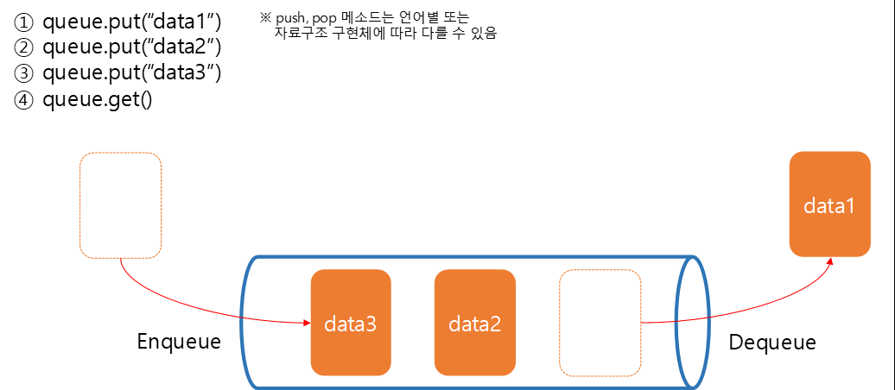

## 큐(Queue)
* 먼저 넣은 데이터를 먼저 반환하도록 설계된 메모리 구조
* First In First Out (FIFO)로 구현
* Stack과 반대되는 개념
* 입력을 Put, 출력을 Get



### 파이썬 큐 구현
* 기본적으로 리스트를 활용하여 큐 구조 구현
* put은 append(), get은 pop()
```
>>> queue = [2, 4, 6, 8, 10]
>>> queue.append(12)
>>> print(queue)
[2, 4, 6, 8, 10, 12]
>>> queue.pop(0)
2
>>> queue.pop(0)
4
>>> queue.pop(0)
6
>>> print(queue)
[8, 10, 12]
>>>

```
