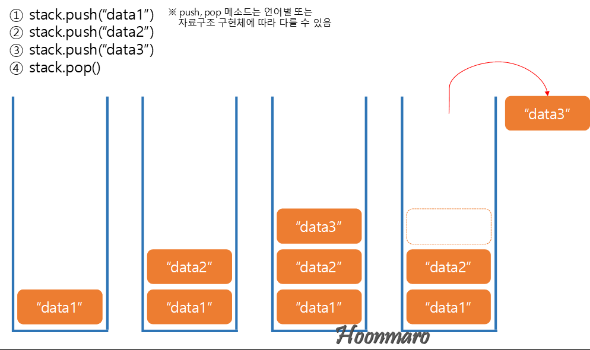

# 필요성
* 특징 있는 정보를 어떻게 저장해야 효율적으로 관리할 수 있을까?

# 자료구조(Data Structure)
* 메모리 상에 데이터를 효율적으로 관리하는 방법
* 검색, 저장 등의 작업에서 효율을 고려하여 메모리 사용량과 실행시간 등을 최소화 함
* 파이썬에서는 리스트, 튜플, 집합(Set), 사전(dictionary) 등의 기본 데이터 구조를 제공함

## 스택(Stack)
* 나중에 넣은 데이터를 먼저 반환하도록 설계된 메모리 구조
* Last In First Out(LIFO)로 구현
* Data의 입력을 Push, 출력을 Pop 이라고 함
* 예) 택배 트럭의 짐



### 파이썬 스택 구현
* 기본적으로 List 사용하여 구현
```
>>> stack = [2, 4, 6, 8, 10, 12]
>>> stack.append(13)
>>> stack.append(14)
>>> print(stack)
[2, 4, 6, 8, 10, 12, 13, 14]
>>> stack.pop()
14
>>> a = stack.pop()
>>> print(a)
13
>>> stack.pop()
12
>>> stack.pop()
10
>>> print(stack)
[2, 4, 6, 8]
```

* Collections 모듈에서 deque가 좀 더 고급스럽게 스택을 다룰 수 있음
