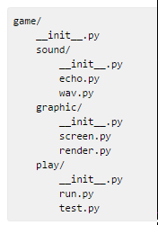
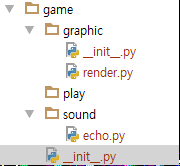

# 패키지(Package)
* 하나의 대형 프로젝트를 만드는 코드의 묶음
* 다양한 모듈들의 합, 디렉터리로 연결됨
* __init__, __mina__ 등 키워드 파일명이 사용됨
* 다양한 오픈소스들이 모두 패키지로 관리됨

## 패키지 만들기
* 기능들을 세부적으로 나눠 디렉터리로 만듦
* 각 디렉터리별로 필요한 모듈을 구현함
* 디렉터리별로 __init__.py 구성

   

* __main__.py 파일 만들기

### __init__.py
* 현재 디렉터리가 패키지임을 알리는 초기화 스크립트
* 없을 경우 패키지로 간주하지 않음(3.3+ 부터는 패키지로 간주)
* 하위 폴더와 py 디렉터리(모듈)을 모두 포함함
* import와 __all__ 키워드 사용
```
__all__=['graphic', 'play', 'sound']
import graphic
import play
import sound
```



