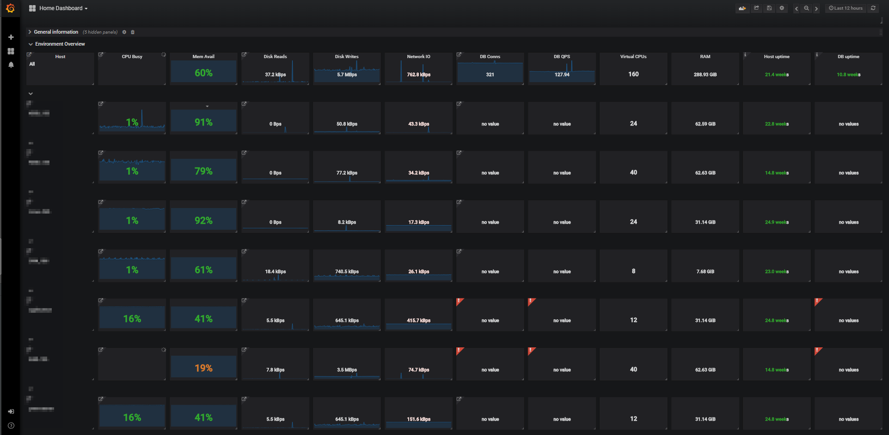
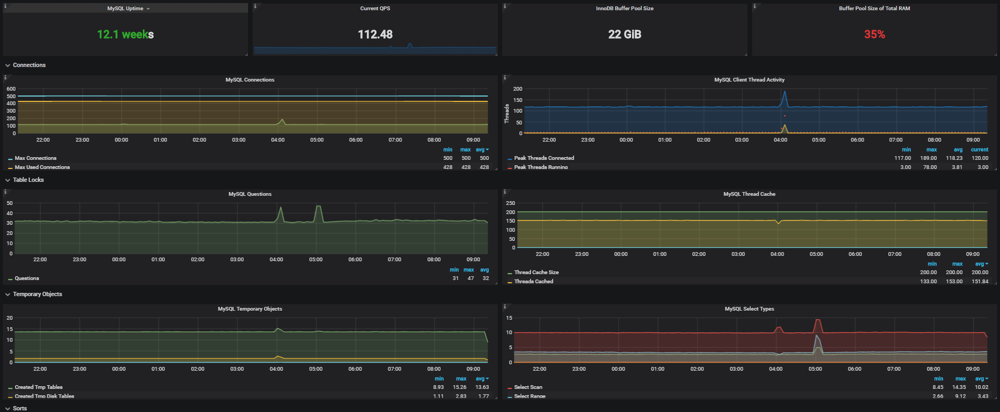

# PMM(Percona Monitoring and Management) 설치

## PMM 이란?
* PMM은 서버/클라이언트로 구성되어 MySQL(MariaDB), MongoDB, OS(Linux)를 모니터링 할 수 있는 플랫폼
* PMM Server: PMM Client에서 수집된 데이터를 저장하겨 웹기반의 대시보드와 그래프 표시
* PMM Client: 모니터링 대상 서버에 설치되는 에이전트로 서버정보, DB정보, 쿼리정보 등을 수집하여 PMM Server에 전달

## 설치
* 테스트 목적으로는 한 대의 서버에 Server/Client를 모두 설치하나 실제 운영상에서는 분리하는 것이 좋음

### 설치환경
* CentOS 7
* Docker

### Docker 설치
* PMM Server는 Docker 이미지로 배포되므로 Docker 설치가 필요하다.

#### 이전 버전의 Docker 삭제 (필요시)
```
> sudo yum remove docker \
                  docker-client \
                  docker-client-latest \
                  docker-common \
                  docker-latest \
                  docker-latest-logrotate \
                  docker-logrotate \
                  docker-selinux \
                  docker-engine-selinux \
                  docker-engine
```

#### 스크립트를 활용한 Docker 설치

```
> wget -qO- https://get.docker.com/ | sh
```

* 참고: [Docker CE on CentOS Documentation](https://docs.docker.com/install/linux/docker-ce/centos/#os-requirements)

### PMM Server 설치
* Docker에서 이미지 받아오기
```
> docker pull percona/pmm-server
```
* 이미지 확인
```
> docker images | grep pmm
```
* PMM 데이터 컨테이너 생성
```
> docker create -v /opt/prometheus/data -v /opt/consul-data -v /var/lib/mysql --name pmm-data  percona/pmm-server /bin/true
```
* PMM 서버 컨테이너 생성 / 실행 (포트 변경이 필요하다면 80:80을 사용할포트:80으로 변경)
```
> docker run -d  -p 80:80 --volumes-from pmm-data  --name pmm-server  --restart always  percona/pmm-server
```
* 생성된 컨테이너 확인
```
> docker ps -a
```
* PMM 메인 페이지: http://서버아이피
* 쿼리분석 페이지: http://서버아이피/qan

### PMM Client 설치

```
> rpm -ivh https://www.percona.com/downloads/pmm-client/1.8.1/binary/redhat/7/x86_64/pmm-client-1.8.1-1.x86_64.rpm
```
* [다운로드 링크](https://www.percona.com/downloads/pmm-client/LATEST/)에서해당 OS의 최신버전 URL을 따와서 위와같이 실행
* 혹은, 파일을 직업 올린 후에 해당 위치에서 위의 명령어 실행

#### Server 등록하기
```
> pmm-admin config --client-name 클라이언트이름 --server 서버아이피:포트
# --bind-address 사설아이피 --client-address 공용아이피 (방화벽 설정이 되어있을 경우)
```
#### 모니터링 서비스 등록하기
* 모니터링 서비스
   * linux:metrics > 일반 시스템 모니터링
   * mysql:metrics > MySQL 모니터링
   * mysql:queries > MySQL 쿼리 모니터링
   * mongodb:metrics > MongoDB 모니터링
   * mysql > linux:metrics + mysql:metrics + mysql:queries
   * mongodb > linux:metrics + mongodb:metrics
```
> pmm-admin add mysql --user root --password 루트비밀번호
```
* 등록 확인하기
```
> pmm-admin list
```

#### 설치 확인
* http://서버아이피/graph
* admin / admin

---

# Gmail Alert 설정
```
> docker ps
# 결과
CONTAINER ID        IMAGE                COMMAND                CREATED             STATUS              PORTS                           NAMES
d99b87dbc8f1        percona/pmm-server   "/opt/entrypoint.sh"   13 days ago         Up About a minute   443/tcp, 0.0.0.0:9001->80/tcp   pmm-server
```
```
> docker exec -it CONTAINER ID /bin/bash
# pmm-server 컨테이너의 bash 쉘에 접속

> vi /etc/grafana/grafana.ini
```
## grafana 설정 수정
```
[smtp]
enabled = true
host = smtp.gmail.com:465
user = your.gmail.account@gmail.com
password = yourpassword
cert_file =
key_file =
skip_verify = false
from_address = admin@grafana.localhost
from_name = PMM
```
* `ctrl + d` 또는 `ctrl + p` + `ctrl + q` 로 도커 컨테이너 쉘 종료
* pmm-server 도커 컨테이너 재시작
```
> docker restart pmm-server
```
* Grafana 대쉬보드 접속 → 좌측 상단 Grafana 아이콘 클릭 → 드롭다운 메뉴에서 Alerting 클릭
* Create an alert notification 클릭
```
Name: Gmail Alert
Type: email
Send on all alerts: Check
Include Images: Check
Email Address: 받을 사람 주소 목록 (여러개일 경우 ; 로 구분)
```
## Example (Grafana Dashboard)


