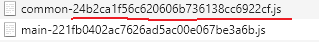
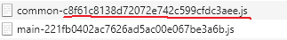
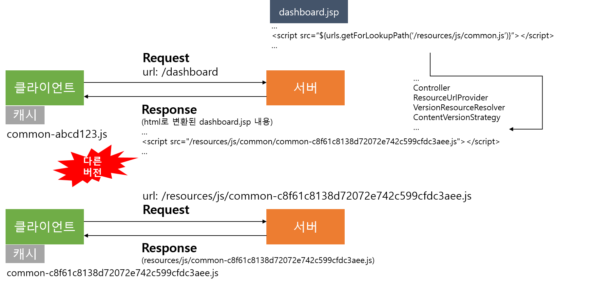

# 스프링 프레임워크 정적 자원 버전 관리

## HTTP 캐싱
* 네트워크를 통해 자원을 가져오는 작업은 느리고 비용이 발생한다. 특히, 크기가 크면 그만큼 브라우저가 화면을 표시하는데 오래 걸려 사용자 경험이 나빠진다.
* 가져온 자원을 캐시했다가 재활용하는 것은 성능 최적화에 중요하다.
* 모든 브라우저는 HTTP 캐시 구현 기능이 포함되어 있다.
* 개발자는 각 서버 응답이 브라우저에 응답을 캐시할 수 있는 시점과 그 기간을 지시하게 위한 HTTP Header를 올바르게 제공해야한다.


## 정적 자원 버전 관리
* 브라우저는 한 번 방문한 사이트의 정적 자원은 캐시가 되어 만료 될 때까지 사용한다.
* 이때문에 정적 자원이 수정된 후에 사이트를 방문한 사용자는 최신 정적 자원을 사용하는 반면, 이전에 방문했던 사용자는 과거 정적 자원을 사용하게 되어 이슈가 발생할 수 있다.
* 예) 이미지가 다르게 보임, 수정된 자바스크립트가 실행이 안되거나 동작이 달라짐
* 따라서 `정적 자원의 버전관리`를 통해 수정된 정적 자원일 경우 새로운 버전이 제공되어 사용자들이 서버에서 최신 버전 정적 자원을 받을 수 있도록 해야한다.

### 정적 자원 캐시 만료되는 경우
* 사용자 직접 삭제
* max-age 또는 expires로 정해진 기한이 지난 경우
* 정적 자원의 URL을 변경한 경우

## 스프링 프레임워크에서 정적 자원 버전 관리
* 스프링 프레임워크는 4.1 버전 이후부터 `WebMvcConfigurer`의 `addResourceHandlers` 설정 메서드에서 버전 관리 핸들러를 리졸버를 등록하여 관리할 수 있다.
* ContentVersionStrategy 통해서 브라우저가 요청한 자원 각 파일의 내용에 따라 MD5 해쉬된 문자열이 요청한 자원 파일명 뒤에 버전처럼 붙는다.
* 수정된 정적 자원의 경우 파일 내용이 바뀌므로 서버에서 응답한 요청한 자원 파일명에 붙은 MD5 해쉬 문자열이 사용자의 브라우저가 캐시해서 가지고 있던 것과 다르기 때문에 새로 내려받게 된다.

### WebMvcConfig 설정
```
@Configuration
public class MvcConfig implements WebMvcConfigurer {

@Override
public void addResourceHandlers(final ResourceHandlerRegistry registry) {
        registry.addResourceHandler("/resources/**", "/webjars/**")
                .addResourceLocations("/resources/", "classpath:/META-INF/resources/webjars/")
                .setCacheControl(CacheControl.maxAge(365, TimeUnit.DAYS))
                .resourceChain(true)
                .addResolver(new VersionResourceResolver().addContentVersionStrategy("/**"))
                .addResolver(new WebJarsResourceResolver());
	}

}

```

### 정적 자원 접근 처리 설정
* 컨트롤러 어드바이스 설정을 ResourceUrlProvider를 모든 응답에 urls라는 이름으로 제공한다.
* 템플릿에서 urls로 접근이 가능하다.
```
@ControllerAdvice
public class ResourceUrlAdvice {

    @Autowired
    private ResourceUrlProvider resourceUrlProvider;

    @ModelAttribute("urls")
    public ResourceUrlProvider urls() {
        return this.resourceUrlProvider;
    }
}
```

### JSP에서 사용
```
<!-- CSS -->
<link rel="stylesheet" href="${urls.getForLookupPath('/resources/sss/style.css')}" />

<!-- JavsScript -->
<script src="${urls.getForLookupPath('/resources/js/common/common.js')}"></script>
<script src="${urls.getForLookupPath('/resources/js/main.js')}"></script>

```

### 예시
#### 이전 버전


#### 변경된 버전



### 흐름



## 생각해볼 점
* 하나의 HTTP 요청에 필요한 정적 자원을 하나씩 검사하는 부분이 추가 되므로 극악한 상황의 네트워크, 서버 환경에서는 성능에 악영향을 줄 수도 있을 것 같다.
* 하지만 일반적으로 문제는 없고, 오히려 버전 관리가 안되서 사용자가 과거 버전의 자원을 가진 채로 사이트가 운영됨으로 발생하는 이슈에 대한 비용이 더 클 것 같다.


# 참고
* [HTTP 캐싱(구글 개발자 가이드)](https://developers.google.com/web/fundamentals/performance/optimizing-content-efficiency/http-caching?hl=ko)
* [RFC 7234 2. Overview of Cache Operation](https://tools.ietf.org/html/rfc7234#page-5)
